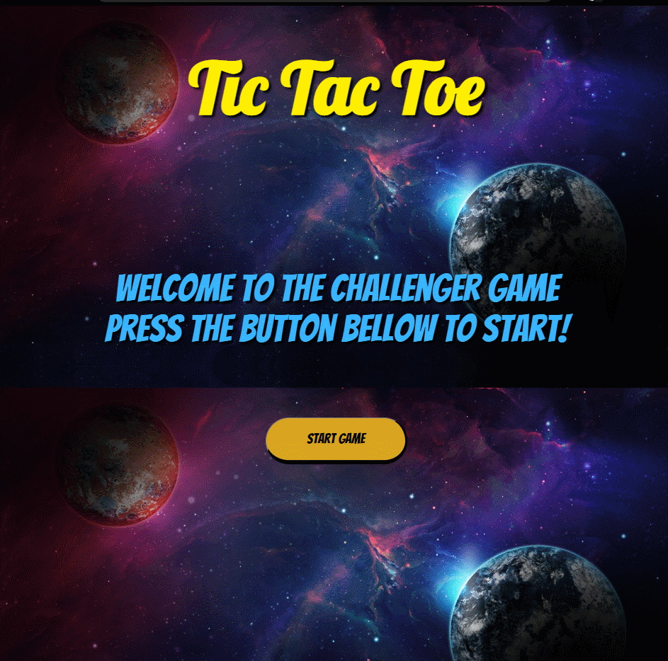

# Tic Tac Toe Game 

### This project was presented on the course "Programador BR" and it's an application of JavaScript, CSS and HTML only, focused on Front-End Developers skills.

### Rules

This is a <strong>simple game</strong>, where to win you must complete a sequential line (3 spots) on horizontal, vertical or diagonal

### Skills

To make this project, I used <strong>functional programming in JavaScript, flex displays, animations, transitions and stylization on CSS and basic HTML tags.</strong>

### You can play this project at that link: https://renato-dantas.github.io/TicTacToe

## Please feel free to suggest any improvements!